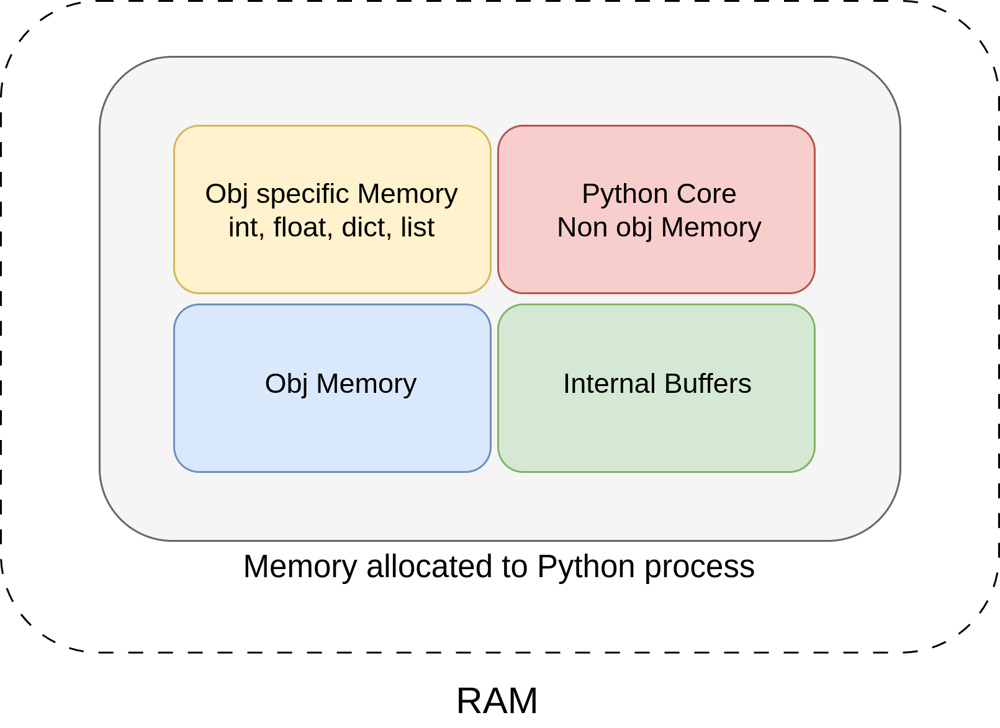
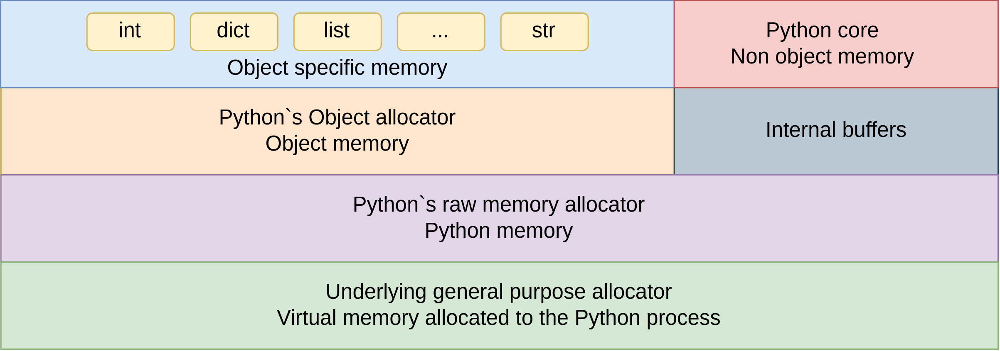
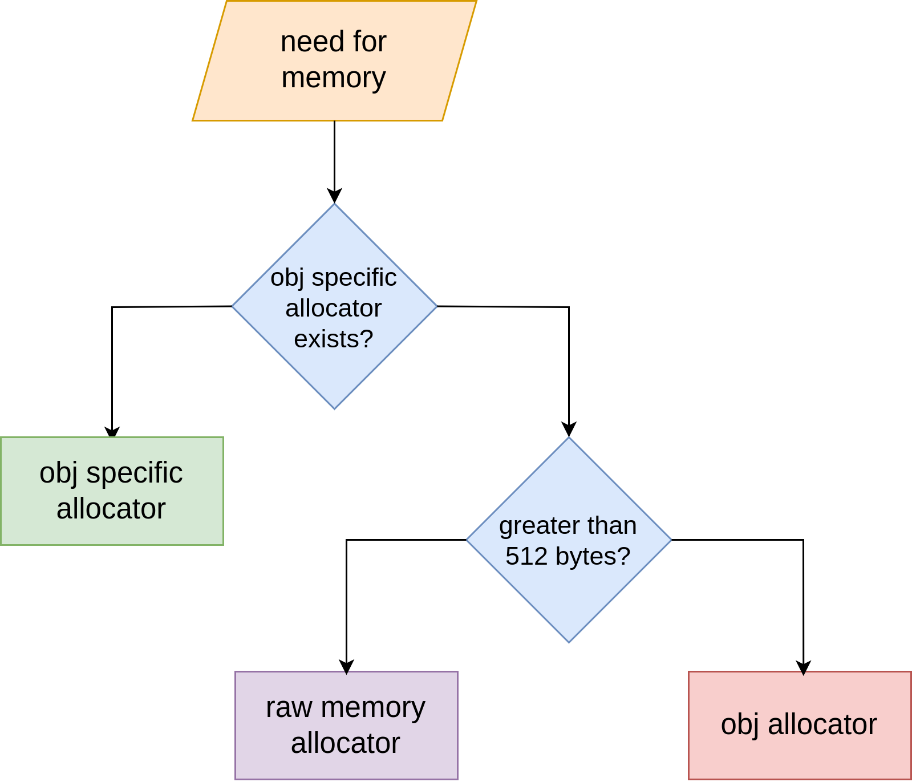
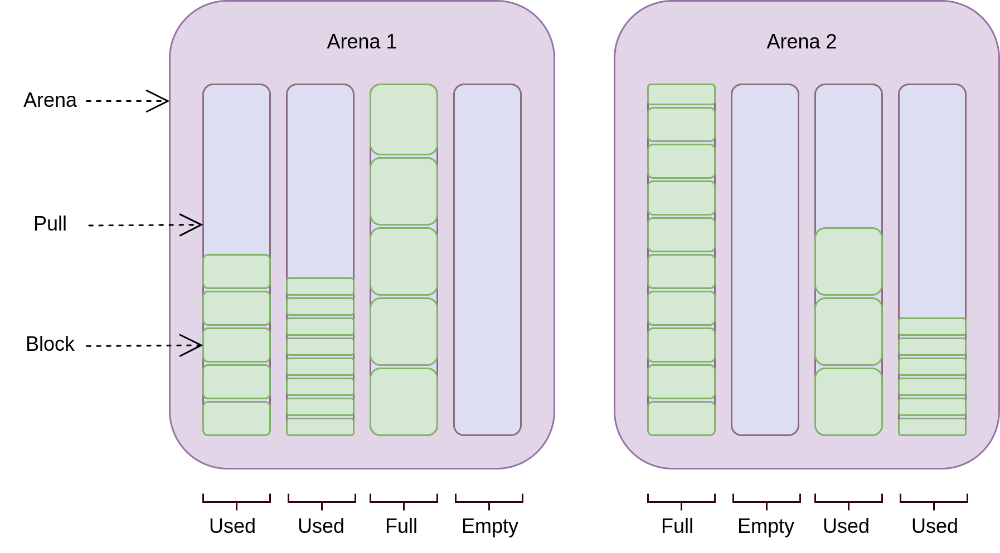
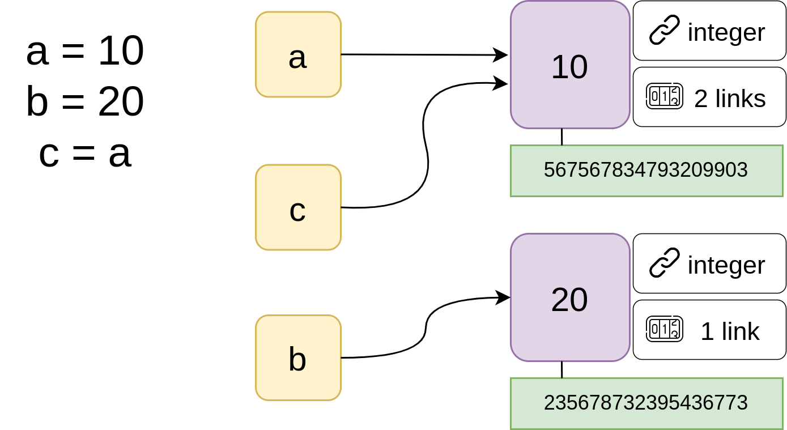
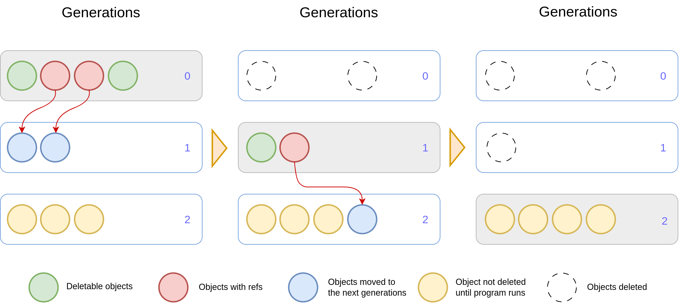

# Мистецтво управління пам'яттю у Python: розуміння, використання та оптимізація

>                                 Твоя пам'ять - монстр; ти забуваєш - вона не забуває. 
>                                 Вона просто відкладає речі в довгий ящик. 
>                                 Вона зберігає інформацію для тебе або ховає її від тебе -  
>                                 і викликає її у голові за власним бажанням. 
>                                 Ти думаєш, що володієш пам'яттю, але насправді вона володіє тобою!
>                                 Джон Ірвінг

Привіт усім шукачам істини! Якщо ви прагнете опанувати мистецтво ефективного використання об'єктів у Python, обирати найкращі підходи для конкретних задач і загалом глибше розуміти цю мову програмування, вам неодмінно потрібно розібратися з тим, як працює пам’ять у Python та яку роль у цьому процесі відіграє garbage collector. Саме про це сьогодні і поговоримо.

**Пам'ять** — це одна з найважливіших складових комп'ютера, яка дозволяє зберігати і отримувати інформацію. Коли ми говоримо про пам'ять, зазвичай одразу спадає на думку RAM та жорсткі диски.
Оперативна пам'ять (RAM) — це тимчасове сховище даних, до якого процесор має швидкий доступ під час виконання програм. Вона зберігає дані лише тоді, коли комп'ютер увімкнений. Це дає можливість програмам швидко обробляти інформацію, з якою вони працюють в конкретний момент.
Постійна пам'ять (жорсткі диски або SSD), навпаки, зберігає дані навіть після вимкнення комп'ютера. Це довготривале сховище, де зберігаються файли, програми, операційна система та інші важливі дані.

Коли ми програмуємо на Python, ми часто не замислюємося про те, як саме працює пам'ять. Однак розуміння цього процесу може значно покращити ефективність програм та оптимізувати код. Розглянемо детальніше, як Python працює з пам'яттю, які є особливості і на що варто звертати увагу.


## Структура пам’яті в Python

У цьому розділі буде багато технічної нудьги, але раджу не пропускати його, бо розуміння цих основ є чудовим підґрунтям для подальшого занурення у тему пам’яті в Python.

Перше, що слід сказати: пам’ять у Python це купа. Що це означає?
**Купа** — це область пам'яті, яка керується спеціальним механізмом виділення пам'яті. На відміну від стека, де пам'ять виділяється і звільняється в певному порядку (LIFO — останній прийшов, перший пішов), у купі пам'ять виділяється та звільняється динамічно, за потреби. Організація стеку дуже ефективна, але підходить лише для даних, які мають короткочасне життя, як-от локальні змінні функцій. Об'єкти у купі можуть створюватися в будь-який момент, і Python зберігає їх у купі, поки вони потрібні. Пам'ять під об'єкти в купі може бути звільнена в будь-який час, коли ці об'єкти більше не використовуються. Ця гнучкість дозволяє зберігати об'єкти з довшим життям і різними розмірами, що не завжди зручно або можливо зробити у стеку.

Пам'ять в Python можна розділити на кілька категорій, кожна з яких відповідає за зберігання різних типів даних і структур.



**Об'єктно-специфічна пам'ять** — це частина пам'яті, яка виділяється для об'єктів, що використовують спеціалізовані механізми управління пам'яттю, відмінні від стандартних. Це дозволяє оптимізувати зберігання та доступ до даних для певних типів об'єктів.
Вона включає в себе спеціальні алокатори, тобто деякі об'єкти, такі як списки, словники або масиви, можуть використовувати власні алокатори пам'яті, оптимізовані для їхніх потреб. Про те, що таке алокатор, ми поговоримо пізніше.
Об'єкти можуть мати власні внутрішні структури даних, які потребують спеціального управління пам'яттю, наприклад, дерева, графи тощо. Для деяких об'єктів пам'ять може виділятися з попередньо зарезервованих пулів для швидкого виділення та звільнення.

**Необ'єктна пам'ять ядра Python** — це частина пам'яті, яка виділяється для зберігання даних та структур, що не є об'єктами Python. Вона використовується самим інтерпретатором для забезпечення своєї роботи та управління виконанням програм.
Що включає в себе? Дані, необхідні для роботи самого інтерпретатора Python, такі як стеки викликів, таблиці символів, інформація про потоки виконання тощо. Інформація, яка використовується для відстеження стану інтерпретатора, наприклад, конфігураційні параметри, налаштування середовища виконання.

**Пам'ять об'єктів** — це частина пам'яті, яка виділяється для зберігання самих об'єктів Python. Кожен об'єкт у Python (числа, рядки, кастомні класи тощо) займає певний обсяг пам'яті, який необхідний для зберігання його даних та метаданих.
Ця частина пам’яті включає в себе реальні дані, які зберігає об'єкт (наприклад, значення числа, текст рядка тощо). Може включати інформацію, необхідну для управління об'єктом, як-от тип об'єкта, кількість посилань на нього (для відстеження життєвого циклу, про це також пізніше детальніше), стан об'єкта тощо.

**Внутрішні буфери** — це області пам'яті, які виділяються інтерпретатором Python для тимчасового зберігання даних під час виконання різних операцій. Вони використовуються для оптимізації роботи і забезпечення ефективності різних процесів.
Буфери вводу/виводу зберігають дані, що читаються з файлів або мережі, а також дані, що готуються для запису. Це дозволяє оптимізувати операції вводу/виводу, зменшуючи кількість системних викликів.
Буфери інтерпретації коду зберігають проміжні результати під час компіляції та виконання байт-коду Python.
Кеші слугують для зберігання даних, що часто використовуються, або результатів обчислень, щоб уникнути повторних витратних операцій.


### Розподільники пам'яті

Коли програма запитує пам'ять, CPython інтерпретатор використовує _malloc_ метод для запиту цієї пам'яті в операційної системи, і розмір приватної купи збільшується.
Щоб уникнути виклику _malloc_ і _free_ для кожного створення і видалення невеликого об'єкта, CPython визначає кілька алокаторів і деалокаторів для різних цілей. 
Простими словами **алокатор пам'яті** — це "менеджер", який відповідає за виділення і звільнення пам'яті для програм, які її потребують. Щоб стало ще зрозуміліше, уявіть, що у вас є шафа з поличками, де кожна поличка — це частина пам'яті. Алокатор — це людина, яка ставить на полички речі (дані) і прибирає їх, коли вони більше не потрібні, щоб звільнити місце для нових.
Отже, щоб уникнути частого виклику методів _malloc_ і _free_, CPython визначає ієрархію алокаторів.



**Універсальний алокатор** (метод CPython _malloc_) — це основний механізм виділення пам'яті, який використовує стандартну функцію _malloc_ із C для виділення пам'яті. Він застосовується для виділення великих блоків пам'яті та для системних викликів. Усі інші розподільники можуть використовувати цей універсальний алокатор як основу для своїх операцій.

**Алокатор необробленої пам'яті** (для об'єктів розміром більше 512 байт): якщо об'єкт має розмір більший за 512 байт, то пам'ять для нього виділяється окремо, без додаткової оптимізації, прямо з купи. Це забезпечує швидке виділення великих блоків пам'яті, але без спеціальної оптимізації для менших об'єктів, що може призвести до фрагментації пам'яті.

**Фрагментація пам'яті** — це проблема, коли вільне місце в пам'яті розбивається на дрібні шматочки, і стає важко знайти достатньо великого безперервного простору для нових даних. Розглянемо простий приклад: якщо б ми мали багато маленьких вільних місць у валізі, але не могли б покласти туди великий предмет, бо всі ці місця розкидані і не з'єднані в єдиний простір.


**Алокатор об'єктів** (для об'єктів розміром менше або рівним 512 байт) використовує певну структуру (арени, пули, блоки) для оптимізації зберігання та мінімізації фрагментації пам'яті. Він забезпечує швидкий доступ до невеликих блоків пам'яті, що часто використовується Python для роботи зі змінними та іншими об'єктами.

**Специфічні для об'єктів алокатори**: деякі типи об'єктів, такі як списки, словники або кортежі, мають спеціалізовані алокатори, які налаштовані на ефективне зберігання та управління пам'яттю для цих конкретних типів даних. Вони можуть використовувати особливі алгоритми або структури даних для оптимізації, зважаючи на специфіку використання відповідних об'єктів.

Тож ми розібрали кожен з прошарків цієї ієрархії. Але залишилося питання, як це все в результаті працює?



Коли об'єкт потребує пам'ять, і для нього визначені специфічні алокатори, виділення пам'яті відбувається саме через ці спеціалізовані алокатори.
Якщо для об'єкта немає визначених специфічних алокаторів, і потрібен обсяг пам'яті більше 512 байт, менеджер пам'яті Python безпосередньо звертається до алокатора необробленої пам'яті.
Якщо ж обсяг запитуваної пам'яті менший за 512 байт, то для її виділення використовуються стандартні алокатори, оптимізовані для роботи з дрібними об'єктами.

### Алокатор об’єктів

Давайте детальніше розглянемо, як працює стандартний алокатор. Алокатор складається з принципово важливих трьох компонентів: арени, пули і блоки.

**Арена** — це велика область пам'яті (зазвичай 256 КБ), яка виділяється операційною системою. Python керує кількома аренами, кожна з яких може містити кілька пулів.

**Пул** — це фрагмент пам'яті фіксованого розміру (зазвичай 4 КБ), що виділяється з арени. Кожен пул спеціалізується на виділенні пам'яті під об'єкти певного розміру. Наприклад, один пул може використовуватися для об'єктів розміром 16 байтів, інший — для об'єктів розміром 32 байти тощо. Це дозволяє ефективно використовувати пам'ять і зменшити фрагментацію (згадуємо валізу).

**Блок** — це найменша одиниця пам'яті, яка виділяється для об'єктів. Кожен пул ділиться на блоки однакового розміру. Коли створюється об'єкт, пам'ять під нього виділяється у вигляді одного або кількох блоків з відповідного пулу. 

Як це працює разом? Коли потрібно виділити пам'ять під новий об'єкт, Python шукає потрібну арену. Якщо не знаходить, запитує нову в операційної системи. Для того, щоб додати новий об’єкт обирається найбільш заповнена арена для більш компактного розміщення об’єктів в пам’яті. 
Далі вибирається необхідний пул (відповідно до розміру об'єкта) і виділяється потрібна кількість блоків. Якщо в пулі немає вільних блоків, виділяється новий пул із наявної арени або створюється нова арена. 

Як саме це вирішується? Пул має три можливі стани: Full, Used, Empty.
Full пули не використовуються для виділення нової пам'яті, оскільки всі блоки вже зайняті.
Used пулам Python надаємо перевагу при створенні нових об'єктів, тобто якщо потрібний розмір блоку доступний, пам'ять буде виділена з цього пулу.
Та Empty пули використовуються, якщо всі пули зі станом used заповнені або не підходять за розміром, пул переходить у стан used після виділення першого блоку.

Блоки в середені пула використовуються безпосередньо для зберігання об’єкта. Кожен блок може бути розміром 8, 16, 24, 32 …, 512 байт. Коли потрібно розмістити об’єкт, береться перший вільний блок, що підходить за розміром (наприклад, для об’єкту розміром 15 байт буде виділено блок на 16 байт). Вільні блоки можуть бути повторно використані для інших об'єктів того ж розміру. Якщо ж всі блоки в пулі вільні, пул може бути повернутий до арени і звільнений.



Така структура дозволяє ефективно управляти пам'яттю, зменшуючи фрагментацію та прискорюючи виділення пам'яті. Це особливо корисно для малих об'єктів, які часто створюються і знищуються в Python.


## Як Python працює з пам’яттю

Ми звикли сприймати вираз `a = 10`, як запис числа `10` у змінну `a`. Насправді ж у Python немає змінних як таких.
Коли ми присвоюємо змінній якесь значення, Python не зберігає число `10` у змінній `а`, натомість він створює об'єкт (у даному випадку ціле число `10`) в пам'яті і зберігає посилання на цей об'єкт у змінній `а`.
Якщо ми присвоїмо `a` нове значення, наприклад, `а = 20`, Python створить новий об'єкт (число `20`) і змінить посилання в `а`, щоб воно вказувало на цей новий об'єкт. Попередній об'єкт (число `10`) залишається в пам'яті, поки на нього будуть існувати інші посилання. Як тільки посилань не залишиться, його пам'ять може бути звільнена.
Якщо ми присвоїмо `b = a`, то змінна `b` тепер теж буде посилатися на той самий об'єкт, на який посилається `a`. Тобто і `a`, і `b` вказуватимуть на одне і те ж число `20` в пам'яті.

У Python кожен об'єкт у пам’яті містить поля _ob_refcnt_ та _ob_type_. Вони є частинами внутрішньої структури об'єктів і відіграють ключову роль в управлінні пам'яттю та визначенні типу об'єкта.

_ob_refcnt_ (Reference Count) — це лічильник посилань на об'єкт. Він зберігає кількість посилань, які вказують на цей об'єкт. 
Коли ми створюємо нове посилання на об'єкт (наприклад, присвоюємо його іншій змінній), _ob_refcnt_ інкрементується. Коли одне з посилань видаляється або змінюється (наприклад, коли змінна, яка посилалася на об'єкт, змінює своє значення), _ob_refcnt_ зменшується. Коли лічильник досягає нуля (тобто на об'єкт більше немає посилань), Python автоматично звільняє пам'ять, зайняту цим об'єктом. Цей процес є частиною механізму збирання сміття (garbage collection), про що пізніше.

_ob_type_ (Type Information) — це вказівник на структуру, яка описує тип об'єкта.
Цей вказівник посилається на відповідний тип об'єкта, наприклад, ціле число, рядок, список тощо.
_ob_type_ визначає, які операції можна виконувати над об'єктом, і як ці операції слід реалізовувати. Наприклад, для числа і рядка визначаються різні способи обчислення, копіювання та перетворення.



Нащо нам це все? _ob_refcnt_ забезпечує автоматичне керування пам'яттю, допомагаючи Python звільняти пам'ять, коли вона більше не потрібна. _ob_type_ гарантує, що кожен об'єкт має правильний тип і що всі операції з ним виконуються відповідно до цього типу.


## Як Python очищає пам’ять

Уявіть, що ви готуєте на кухні. Спочатку у вас є чистий стіл і все необхідне під рукою. Але поступово посуд, обрізки овочів і використані інгредієнти починають накопичуватися, і робочий простір стає все меншим. Нарешті, стає важко знайти місце для роботи. Так само відбувається, коли в програмі накопичуються об'єкти, що не використовуються, це може перевантажити пам'ять і уповільнити роботу програми.
І тут у нас є два рішення: прибрати кухню самостійно або ж викликати прибиральника, який зробить все за нас.

Перший спосіб — поприбирати непотрібні об’єкти в пам’яті самостійно — ми можемо реалізувати за допомогою функції _del_. Важливо сказати, що насправді _del_ — це ключове слово, а не функція, тому краще казати "оператор _del_", але в багатьох джерелах все ж таки використовується термін "функція _del_", тож нехай.
Функція _del_ у Python використовується для видалення посилань на об'єкти. Варто розуміти, що _del_ не знищує сам об'єкт, а видаляє посилання (змінну), яке вказує на цей об'єкт.

Як це працює? Якщо ми використовуємо _del_ для змінної, ця змінна перестає існувати. 

```python
a = 10
print(id(a)) # 11167752
del(a)
print(a)  # NameError: name 'a' is not defined
print(id(10)) # 11167752
```

Коли _del_ видаляє посилання на об'єкт, це зменшує лічильник посилань (_ob_refcnt_) цього об'єкта. Якщо після цього на об'єкт більше не залишилось посилань, Python може звільнити пам'ять, зайняту цим об'єктом. Але якщо на об'єкт є інші посилання, пам'ять не буде звільнена до тих пір, поки всі посилання не будуть видалені. А також слід сказати, що функція del() не може видалити вбудовані типи об'єктів або деякі системні об'єкти, наприклад, числові літерали.

### Підрахунок посилань та пошук циклів

Тож самостійно ефективно поприбирати непотрібні об’єкти в пам’яті наврядчи вийде, давайте звернемося до готового клінінг-сервісу, і у Python такий існує.
Для того, щоб очистити пам’ять, використовуються два методи: підрахунок посилань та пошук циклів.

Як працює метод підрахунку посилань? Цей механізм відстежує, скільки разів об'єкт використовується у коді рантайму, тобто скільки посилань налічується в _ob_refcnt_ і автоматично звільняє пам'ять, коли об'єкт більше не потрібен. Згадуємо: у кожного об'єкта в Python є лічильник посилань, який зберігає кількість посилань на цей об'єкт. Коли ми створюємо посилання на об'єкт, цей лічильник збільшується, при видаленні — відповідно зменшується. Якщо лічильник посилань досягає нуля, тобто на об'єкт більше немає посилань, пам’ять, що займає цей об’єкт, звільняється автоматично.

Що ж до пошуку циклів? Іноді може виникати ситуація, коли об'єкти посилаються один на одного, утворюючи цикли (_A_ посилається на _В_, _В_ посилається на _С_, _С_ посилається на _А_). У таких випадках, навіть якщо всі зовнішні посилання на ці об'єкти видалені, їхні лічильники посилань не стають нульовими, і пам'ять не звільняється. Щоб вирішити цю проблему, йде перевірка об'єктів на наявність циклічних посилань, і пам'ять звільняється, якщо такі цикли знаходяться.

До слова, скільки посилань має той чи інший об’єкт у пам’яті, можна легко перевірити, використовуючи бібліотеку _sys_.

```python
import sys


print(sys.getrefcount('new object')) # 3
print(sys.getrefcount(0)) # 1000000791

a = 0
b = 'new object'

print(sys.getrefcount('new object')) # 4
print(sys.getrefcount(0)) # 1000000792
```

Функція _sys.getrefcount_ сама посилається на об'єкти, тому не дивно, що на тільки-но створений об'єкт маємо одразу три посилання. На невеликі числа часто посилається сам Python інтерпретатор, тому кількість посилань на них буде досить великою.

Повернемося до підрахунку посилань та пошуку циклів. Усе ніби гарно працює, але завжди має бути якесь “але”. Тож метод підрахунку посилань чудово працює з незмінними об’єктами, які посилаються тільки на одну комірку пам'яті (рядки, числа тощо) або на кілька незмінних об'єктів (кортежі, frozen множини тощо), але об'єкти-контейнери можуть обдурити цей механізм, посилаючись самі на себе або один на одного.

```python
import sys


# Об'єкт посилається сам на себе
offices = []
offices.append(offices)

print(sys.getrefcount(offices)) # 3

# Об'єкти посилаються один на одного
departments = []
companies = []
departments.append(companies)
companies.append(departments)

print(sys.getrefcount(departments)) # 3
print(sys.getrefcount(companies)) # 3
```

З цього можемо зробити висновок, що лічильник посилань ніколи не досягне 0, а, отже, пам’ять не буде очищено. Для цього Python пропонує збирач сміття (garbage collector).

### Garbage collector

Garbage collector в Python періодично виконує збір сміття, перевіряючи пам'ять на наявність циклічних посилань і очищаючи їх.
Об'єкти діляться на три "покоління" на основі того, як довго вони існують. Нові об'єкти належать до першого покоління, а старіші переміщуються у друге і третє. Нові об'єкти перевіряються частіше, оскільки вони, швидше за все, стануть непотрібними. Старіші об'єкти перевіряються рідше. Коли Python виявляє, що об'єкти взаємно посилаються один на одного, але не мають зовнішніх посилань, ці об'єкти можуть бути позначені як "сміття", і їхня пам'ять буде звільнена.

Давайте детальніше розглянемо, як об'єкти переміщуються між різними поколіннями, коли вони переживають процес збору сміття, і як ці покоління використовуються для ефективного очищення пам'яті. 



1. Перше покоління (Покоління 0):
   - Нові об'єкти створюються та додаються в Покоління 0.
   - Коли GC запускається, він перевіряє всі об'єкти в Поколінні 0. Якщо об'єкт більше не використовується (немає посилань), він підлягає видаленню (зелений об'єкт).
   - Якщо об'єкт все ще має посилання (червоний об'єкт), він переміщується в Покоління 1.

2. Друге покоління (Покоління 1):
   - Тут збираються об'єкти, які пережили хоча б один збір сміття.
   - GC перевіряє об'єкти в цьому поколінні рідше, ніж у Поколінні 0. Якщо об'єкт більше не використовується, він видаляється.
   - Якщо об'єкт все ще використовується, він може бути переміщений у Покоління 2.

3. Третє покоління (Покоління 2):
   - Це найстаріші об'єкти, які існують у пам'яті довше всього (жовтий об’єкт).
   - Збір сміття тут відбувається ще рідше, ніж у Поколінні 1, оскільки вважається, що ці об'єкти з меншою ймовірністю стануть непотрібними.
   - Після запуску GC об'єкти, які все ще мають посилання, залишаються, а непотрібні видаляються.

У кожного покоління є свій лічильник, який збільшується при виділенні пам'яті об'єктам цього покоління та зменшується при її звільненні. Як тільки це значення перевищує певний поріг, запускається процес збору сміття. Ці порогові значення можна переглянути та змінити, використовуючи бібліотеку gc.

```python 
import gc


print(gc.get_threshold()) # (700, 10, 10)
gc.set_threshold(500, 10, 10)
print(gc.get_threshold()) # (500, 10, 10)
```

## Скільки пам’яті займають об’єкти

Тепер давайте перейдемо на наступний крок знайомства з пам’яттю та проведемо експеримент, скільки пам’яті буде займати той чи інший об’єкт в Python. Розглядатися буде виключно CPython як основна реалізація мови програмування Python. Експерименти та висновки тут не стосуються інших реалізацій Python, таких як IronPython, Jython і PyPy.

### Вимірювання розміру об’єкта

Спершу давайте сформуємо розуміння щодо фактичного використання пам’яті об’єктами Python.
Модуль _sys_ у стандартній бібліотеці Python надає функцію _getsizeof_, яка дозволяє дізнатися, скільки пам'яті займає певний об'єкт у байтах. Це корисно для аналізу використання пам'яті в програмі, особливо якщо ми працюємо з великими даними або оптимізуємо використання пам'яті.
Функція викликає дандер метод _sizeof_ об'єкта. Цей магічний метод визначає кількість байтів, яку об'єкт займає в пам'яті.
У випадку з вбудованими типами даних (списки, словники, кортежі тощо), _sizeof_ визначає основний розмір об'єкта, але не включає розмір об'єктів, на які він посилається. Тому для складних об'єктів (наприклад, вкладених списків) _getsizeof_ може не повністю відображати весь обсяг пам'яті, що використовується.

```python 
import sys

from decimal import Decimal


print(sys.getsizeof(42))  # 28
print(sys.getsizeof(Decimal(5.3)))  # 104
print(sys.getsizeof([1, 2, 3, 4, 5]))  # 104
print(sys.getsizeof('Hello, World!'))  # 62
```

Давайте детальніше розглянемо кожен з основних типів даних та трохи подискутуємо на цю тему.
Спершу рядки.

```python 
import sys


print(sys.getsizeof('')) # 49
print(sys.getsizeof('Hi')) # 51
print(sys.getsizeof('Hello, World!')) # 62
print(sys.getsizeof('Kharkiv is the best city in the world!')) # 87
```

Тож бачимо, що пустий рядок займає 49 байт, а кожен новий символ додає по 1 байту. Хм, але різниця не така велика, чому? Зберігання кількох коротких рядків у Python має додаткові накладні витрати, оскільки кожен рядок створює окремий об'єкт із власними метаданими. Наприклад, короткий рядок _"Hi"_ займає 51 байт, де більшість із цих байтів використовуються для управління об'єктом. Натомість один довгий рядок зберігає більше тексту на одиничний об'єкт, що зменшує накладні витрати на кожен символ, але може бути менш гнучким у використанні. Тому робимо висновок, що за можливості краще зберігати один великий рядок, ніж кілька малих.

З рядками зрозуміло. Як щодо колекцій?

```python
import sys


print(sys.getsizeof([]))  # 56
print(sys.getsizeof([1]))  # 64
print(sys.getsizeof([1, 2, 3, 4]))  # 88
print(sys.getsizeof([1, 2, 3, 4, 5]))  # 104
print(sys.getsizeof([1, 2, 3, 4, 5, 6]))  # 104
print(sys.getsizeof(['Kharkiv is the best city in the world!']))  # 64
```

Та сама історія — навіть порожній список має накладні витрати на зберігання метаданих, таких як інформація про тип об'єкта, розмір, кількість елементів і посилання на самі елементи. 
На цьому моменті може виникнути питання, чому коли список став налічувати один елемент у вигляді числа, кількість пам’яті збільшилась лише на 8 байтів? Додавання числа до списку додає лише 8 байтів, тому що список зберігає лише посилання на об'єкт `int`, а не сам об'єкт. Сам `int` займає 24 байти, але ці байти не дублюються для кожного списку, який посилається на це число. Те саме сталося і в останньому випадку з рядком. Бачимо, що список з одним елементом у вигляді рядка займає лише 64 байти, як і у випадку з числом, бо тут так само пам’ять зайняло посилання на об’єкт, а не його розмір в пам’яті як такий.

Це означає, що функція _getsizeof_ не повертає фактичну пам'ять списку і всіх об'єктів, які він містить, а тільки пам'ять списку і посилання на об'єкти, що в ньому містяться. У наступному розділі ми поговоримо, як вирішити цю проблему.

Звернемо увагу, що для списків _[1, 2, 3, 4, 5]_ та _[1, 2, 3, 4, 5, 6]_ ми отримали однаковий результат по використанню пам'яті. Для збереження списку в пам'яті Python використовує додаткову динамічну структуру. Ця структура включає в себе не лише посилання на елементи списку, але й додатковий простір для можливих майбутніх елементів. Це дозволяє Python швидко додавати нові елементи до списку без необхідності кожного разу перевиділяти всю пам'ять. Ця динамічна структура збільшує накладні витрати пам'яті порівняно з незмінними структурами, такими як кортежі.

Поїхали далі — кортежі.

```python 
import sys


print(sys.getsizeof(()))  # 40
print(sys.getsizeof((1, )))  # 48
print(sys.getsizeof((1, 2, 3, 4)))  # 72
print(sys.getsizeof(('Kharkiv is the best city in the world!', )))  # 48
```

Перше, що слід зауважити, це те, що кортежі займають менше місця, ніж списки. 
Це відбувається, тому що кортежі є незмінними структурами даних. Оскільки їх вміст не може змінюватися після створення, Python може оптимізувати їх зберігання. Списки, на відміну від кортежів, є змінними, і для підтримки цієї гнучкості їм потрібно більше накладних витрат, причина чого була обговорена вище.
А друге — ситуація з порожнім кортежем та заповненим та сама, що й у минулих експериментах.

Підемо далі та поговоримо про множини та словники.

```python 
import sys


print(sys.getsizeof(set())) # 216
print(sys.getsizeof({1})) # 216
print(sys.getsizeof({1, 2, 3, 4})) # 216

print(sys.getsizeof({})) # 64
print(sys.getsizeof({'a': 1})) # 184
print(sys.getsizeof({'a': 1, 'b': 2, 'c': 3})) # 184
```

Бачимо, що при збільшенні кількості елементів в множині чи словнику витрати пам’яті не змінюються. Чому так? 

У Python множини мають певний початковий розмір, і цей розмір не змінюється при додаванні елементів до певної кількості. Це тому що множини використовують хеш-таблиці для зберігання елементів, і хеш-таблиці виділяють фіксовану кількість пам'яті на початку. Коли множина досягає певного розміру, вона може динамічно збільшуватися, але у нашому прикладі пам'ять залишається стабільною.

Словники в Python використовують хеш-таблиці для зберігання пар ключ-значення. Порожній словник займає менше пам'яті, але коли ми додаємо елементи, витрати пам’яті зростають. У нашому випадку розмір словника залишався стабільним на рівні 184 байти після додавання одного або кількох елементів, оскільки Python оптимізує розподіл пам'яті для словників і може використовувати блоки пам'яті, які вже виділені.

Але зауважимо, що накладні витрати на зберігання об’єктів не маленькі. Усе тому що у об'єктів Python величезні фіксовані накладні витрати. Якщо структура даних складається з великої кількості об'єктів колекцій, таких як рядки, списки і словники, які містять невелику кількість елементів кожен, ми багато платимо.


### Вимірювання розміру об’єкта рекурсивно

Повернемося до питання, що відкладали. _getsizeof_ може сказати, скільки пам’яті займає примітивний об’єкт, але є спосіб, що рекурсивно виконує деталізацію і обчислює фактичне використання пам'яті графом об'єктів Python. Це _deep_getsizeof_.

Функція рекурсивно обходить кожен елемент об'єкта (наприклад, елементи списку, значення у словниках, атрибути об'єкта тощо). Вона відстежує вже побачені об'єкти, щоб уникнути повторного підрахунку пам'яті для тих самих об'єктів (наприклад, у випадку посилань на один і той самий об'єкт у різних частинах структури). Результат показує повний розмір об'єкта, включаючи всі вкладені об'єкти, що дає точніше уявлення про споживання пам'яті.

```python 
import sys
from sys import getsizeof
from typing import Any, Container, Mapping


def deep_getsizeof(obj: Any, ids: set[int] | None = None) -> int:
   if ids is None:
       ids = set()


   if id(obj) in ids:
       return 0


   size = getsizeof(obj)
   ids.add(id(obj))


   if isinstance(obj, str):
       return size


   if isinstance(obj, Mapping):
       return size + sum(deep_getsizeof(k, ids) + deep_getsizeof(v, ids) for k, v in obj.iteritems())
   if isinstance(obj, Container):
       return size + sum(deep_getsizeof(item, ids) for item in obj)
   return size


example = [[1, 2, 3], 4, 5, '6', '7']
print('getsizeof for list:', sys.getsizeof(example))
print('deep_getsizeof for list:', deep_getsizeof(example))
```

Час експериментувати. Почнемо з рядків. Наш минулий експеримент на пустому рядку показав результат 49. 

```python
example = '1234567'
print(deep_getsizeof(example)) # 56
```

Перевіривши фактичний розмір даної строки, бачимо, що результат 56 (тобто 49 байтів накладних витрат на створення та збереження пустого рядка та ще 7 байтів на кожен з літералів рядка).

Тепер списки. З минулих результатів пам’ятаємо, що розмір накладних витрат на пустий список становить 56 байтів. Можемо це ще раз перевірити: функція _deep_getsizeof_ для пустого списку покаже нам аналогічний результат.

```python
print(deep_getsizeof([])) # 56
print(deep_getsizeof([example])) # 120
print(deep_getsizeof(5 * [example])) # 152
```

Тож отримуємо 120 байтів для списку з одного елементу: 56 байтів накладних витрат для створення списку + 8 байтів для зберігання посилання на елемент списку example + розмір самого example, що у минулому прикладі, ми з’ясували, становить також 56 байтів. Сума збігається, дійсно 120!

Так само для другого прикладу (56 + 5 * 8 + 56) = 152, не забуваємо, що значення зберігається один раз, а той факт, що в списку 5 елементів змушує нас лише помножити на 5 розмір пам’яті для зберігання посилань. 


### Особливість зберігання чисел у діапазоні між -5 та 256

У Python є цікава оптимізація щодо збереження чисел у діапазоні від -5 до 256. Ці числа зберігаються в пам'яті особливим чином завдяки механізму інтернування.
Що це та як працює? 

Коли Python запускається, він автоматично створює об'єкти для чисел у діапазоні від -5 до 256 і зберігає їх у спеціальному пулі. Ці об'єкти постійно присутні в пам'яті і використовуються повторно кожного разу, коли ми створюємо змінну з таким значенням.
Завдяки цьому підходу Python економить пам'ять і прискорює роботу з числами, що часто використовуються. Наприклад, коли ми присвоюємо змінній значення _100_, Python не створює новий об'єкт, а використовує вже існуючий об'єкт з пулу.

Саме цей діапазон був обраний, виходячи з практичних міркувань. Ці числа часто використовуються в більшості програм, тому їх інтернування дозволяє зменшити навантаження на пам'ять і підвищити продуктивність.

Тобто це означає, що числа в діапазоні перевикористовуються з кожним запуском програми, а ось числа поза діапазоном кожного разу займатимуть різну комірку пам’яті, бо створюватимуться щоразу заново. Можемо це перевірити на практичному експерименті.

```python
print(id(202))
print(id(472))
```

Роздрукуємо ідентифікатор в пам’яті для числа з діапазону та поза ним. Запустимо програму кілька разів. Отримані результати:

```
11173896
140209190427568

11173896
140406733347760

11173896
139721092848560
```

Бачимо доказ того, що число _202_ не створюється заново на початку кожного виконання програми, на відміну від _472_, індентифікатор котрого кожного разу різний.


## Висновки

Знання про управління пам’яттю у Python є важливим елементом для розуміння того, як ефективно працює ваша програма. 

Коли ви знаєте, як Python управляє пам’яттю, ви можете краще контролювати ресурси, уникати витоків пам’яті та оптимізувати код для досягнення максимальної продуктивності. Це знання допомагає не лише у написанні ефективного коду, але й у розробці масштабованих і надійних систем.

Пам'ять у Python включає різні аспекти, їх розуміння допомагає вам краще адаптувати ваші програми до різних умов і сценаріїв використання. Зокрема знання про роботи garbage collector, arenas, pools і blocks дозволяє виявляти і виправляти потенційні проблеми, що виникають при управлінні ресурсами.

Врешті-решт, ефективне управління пам’яттю сприяє створенню швидших і більш стабільних програм, що працюють на будь-якому рівні, від простих скриптів до складних систем. Розуміння основ пам’яті у Python може стати потужним інструментом для кожного розробника, допомагаючи досягти високих результатів у програмуванні.

Дякую за увагу! Не прощаємось.


